# task manager widget

> **A liquid-glass task widget for the GNOME desktop environment.**
> An always-on-bottom card that stays under every window, hides from
> `Alt+Tab` and the workspace switcher, and comes with its own settings app.
>
> **Release: `v2.29-gnome`** — this release is made for, and tested on,
> the **GNOME desktop environment** (X11, or Wayland through XWayland).

> [!IMPORTANT]
> **This release is made for the GNOME desktop environment.** It is built and
> tested on GNOME, and it relies on GNOME honouring `_NET_WM_STATE_BELOW`,
> `SKIP_TASKBAR`, `SKIP_PAGER` and `STICKY`. On another desktop the card may
> float above your windows or show up in the task switcher.

Dark and bright glass variants, soft rounded corners, gentle fading dividers,
15 languages, glass notifications with snooze, and a fold-to-a-rail button.

<p align="center">
  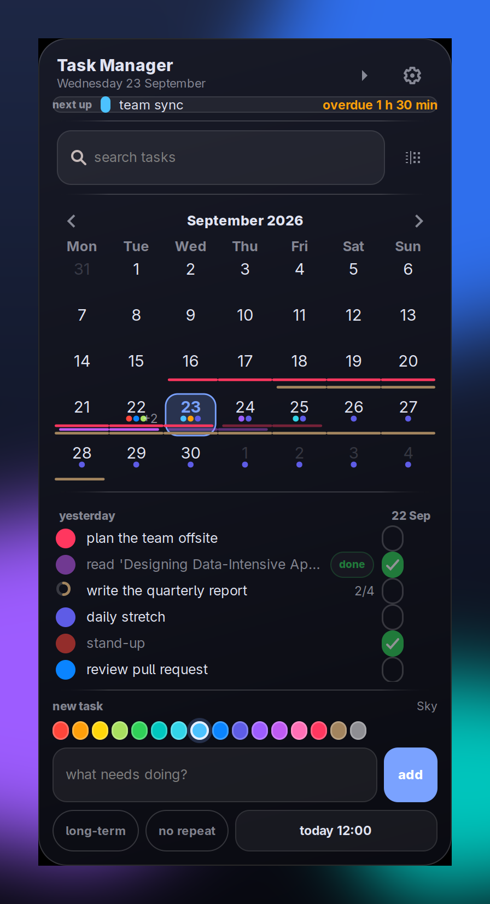
  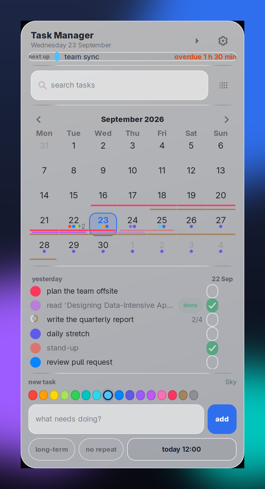
</p>

---

## CONTENTS

- [INSTALATION](#instalation)
- [HOW TO USE](#how-to-use)
- [Screenshots](#screenshots)
- [Keyboard shortcuts](#keyboard-shortcuts)
- [Data & privacy](#data--privacy)
- [Uninstall](#uninstall)
- [Licence](#licence)

---

# INSTALATION

> **Requirements:** GNOME (X11 or Wayland/XWayland), GTK **3** with
> PyGObject + PyCairo, and `paplay` (PipeWire/PulseAudio) for sounds.
> The widget talks to the window manager through XWayland so it can sit
> *under* every other window — a Wayland-native toolkit cannot express that.

**Arch**

```sh
sudo pacman -S python-gobject gtk3 hicolor-icon-theme sound-theme-freedesktop
```

**Debian / Ubuntu**

```sh
sudo apt install python3-gi python3-gi-cairo gir1.2-gtk-3.0 \
                 hicolor-icon-theme sound-theme-freedesktop libpulse0
```

### Option A — from a checkout (simplest)

```sh
git clone https://github.com/MilenPL/TaskManagerWidget.git
cd TaskManagerWidget
./install.sh                 # launchers + icon + autostart
```

That installs:

| what | where |
|---|---|
| `task manager widget settings` launcher | `~/.local/share/applications/` |
| `task manager widget` launcher | `~/.local/share/applications/` |
| app icon | `~/.local/share/icons/hicolor/scalable/apps/` |
| start automatically at login | `~/.config/autostart/task-widget.desktop` |

Use `./install.sh --no-autostart` if you don't want it at login, and
`./install.sh --uninstall` to remove everything it created (your tasks and
settings are kept).

### Option B — with pip / pipx

```sh
pipx install .               # or: pip install --user .
./install.sh                 # still needed for the launchers + autostart
```

Both give you the same two commands: `task-widget` and
`task-widget-settings`.

### Run without installing anything

```sh
./bin/task-widget            # the widget
./bin/task-widget-settings   # "task manager widget settings"
```

---

# HOW TO USE

### The layout, top to bottom

| part | what it does |
|---|---|
| **header** | your title, today's date, the **fold** arrow and the settings gear |
| **next up** | the next task coming up and its countdown — click it to open that day |
| **search + filter** | filter every list as you type; the filter button narrows by colour and hides finished days |
| **month calendar** | a colour dot per planned task, plus coloured underscores spanning long-term tasks. Click a **day number** to set a date, click a day's **dots** to open it |
| **five-day view** | yesterday, today and the next three days — colour and title, with `done` / `time's up` badges |
| **today · times** | today again with `hour.minute`, steps counter, tick box |
| **new task** | 16 colours, title, optional *long-term* deadline, repeat, date/time |

### Creating a task

1. Click a colour, type a title, pick a date/time (or click a day in the
   calendar).
2. Type natural language instead: **`dentist tomorrow at 14:30`** — the words
   become the date and drop out of the title.
3. Tick **long-term** for something that has a deadline instead of a fixed
   time — it runs until you mark it done, and stays listed for two days after
   with `done` or `time's up`.
4. Click **no repeat** to cycle `daily → weekly → monthly`.
5. Press **add** (or Enter).

### Customising it

Everything lives in **task manager widget settings** (`preferences-system` in
your app grid, or the gear on the widget):

- **appearance** — *language* (15), *title* (the word at the top of the
  card), **theme** dark/bright, glass **opacity** (40–100 %), **size**
  (0.85–1.10×) and **corner roundness** (0 = square …48 = fully rounded,
  reshaping the card, the drag curtain and the folded rail live), with a
  preview that follows along.
- **position** — nine presets with **apply**, or **change position** → drag
  the card → **confirm position**.
- **notifications** — pop-ups, sounds, volume, reminder lead time, snooze
  length, pop-up timeout, three sound pickers with **test**, and **do not
  disturb** (a quiet window such as `22:00 → 07:00` that queues alerts and
  shows them when it ends).
- **features** — switch each optional feature on or off independently:
  calendar day popover, steps & progress rings, next-up strip,
  natural-language times, keyboard shortcuts, do-not-disturb. Plus the
  calendar/weekly filters (*show yesterday*, *only not-done tasks*) which are
  separate, so you can filter one and not the other.
- **data & startup** — autostart, app-grid launchers, task count,
  **export/import** JSON backup and **remove finished**.

Changes reach the widget within a second — no restart needed.

### Folding the widget

The small arrow in the header (or `Ctrl+F`) collapses the whole card into a
48 px glass rail showing nothing but an arrow. Pressing it restores the exact
previous view, scroll position included, and the state survives a restart.

### Clearing the default tasks

Your tasks live only in your own account and nothing is shared with other
users on the machine. Three ways to clear them:

1. **One at a time** — hover a task in the widget and click the ✕, or focus
   a row and press `Delete`.
2. **Everything finished** — *settings → data & startup → **remove
   finished*** drops completed and expired tasks only.
3. **Everything, including default/sample tasks** — *settings → data &
   startup → **clear all tasks***. This is destructive, so a dialog opens and
   stays locked until you literally type

   ```
   clear all tasks
   ```

   into the box (case- and space-insensitive), then press the red button.
   **cancel** backs out with everything intact.

   > The confirmation phrase is deliberately never translated — it is a
   > safety token you have to type, not UI copy.

Want a clean slate *and* the sample data back? Just export a backup first
(*data & startup → export tasks…*) and import it later.

### The first-run introduction

The very first time the widget starts it opens a short tour — **using it**
and **making it yours**. **got it** dismisses it for good; **open settings**
jumps straight to the settings app. You can bring it back any time with
**show the introduction again** in the settings footer.

---

## Screenshots

<p align="center">
  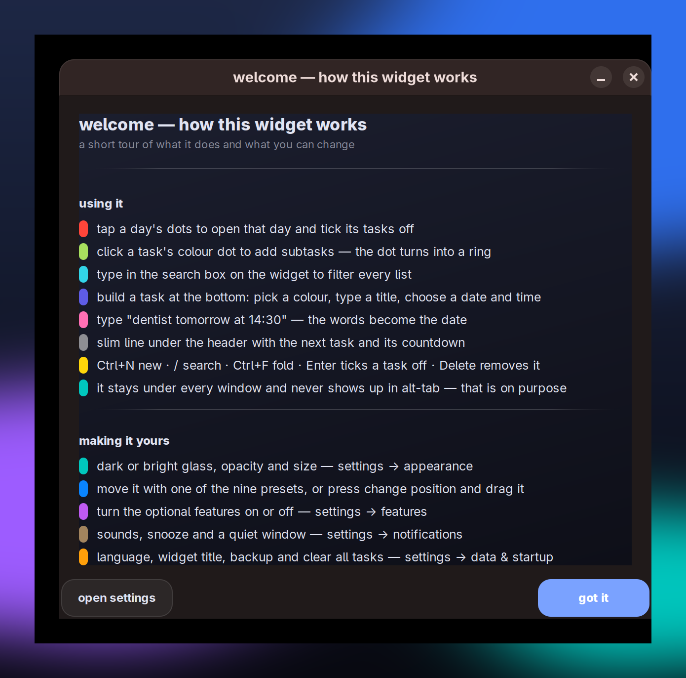
  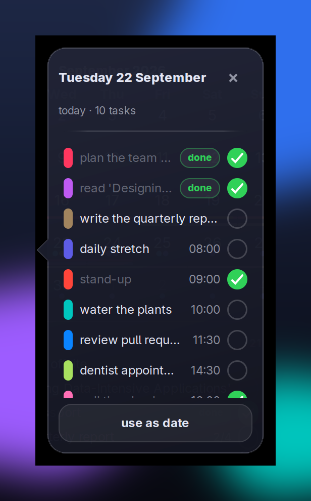
  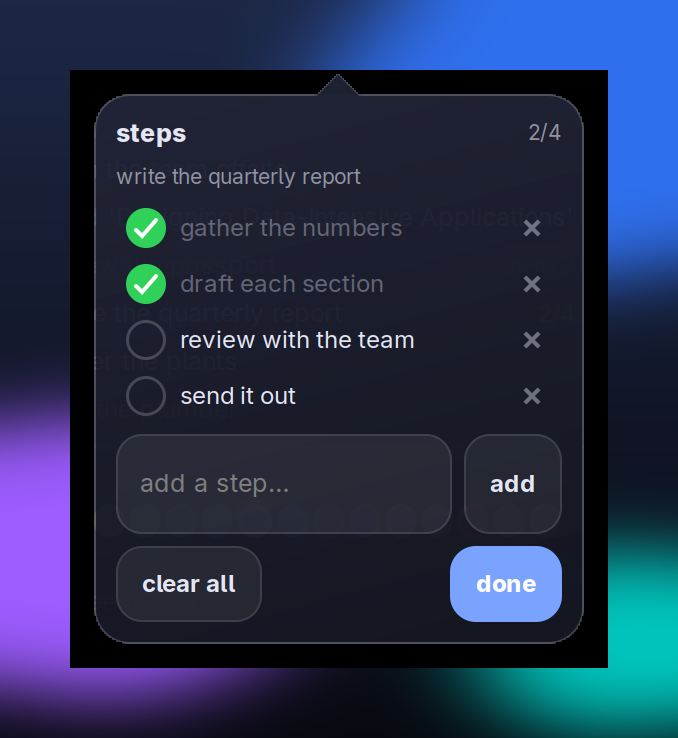
</p>

**Notifications and folding**

<p align="center">
  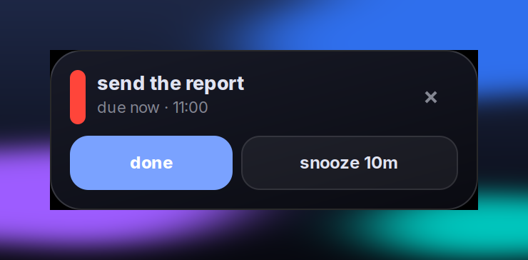
  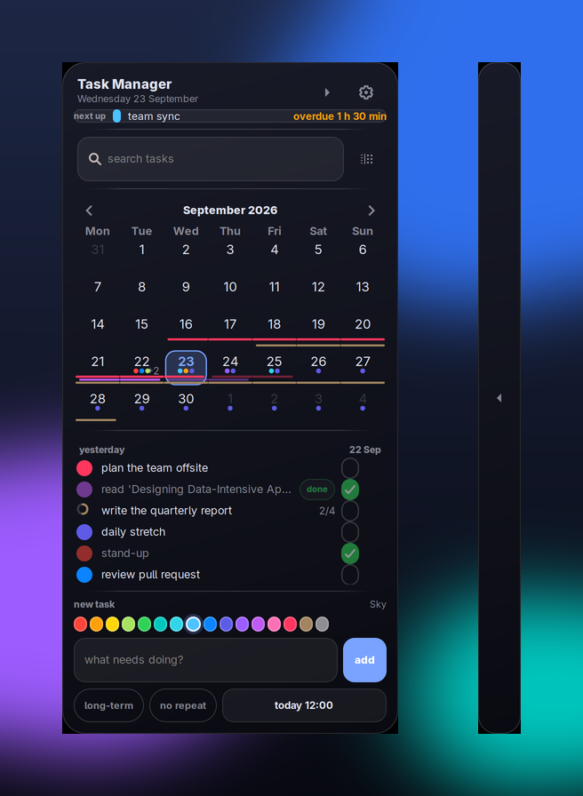
  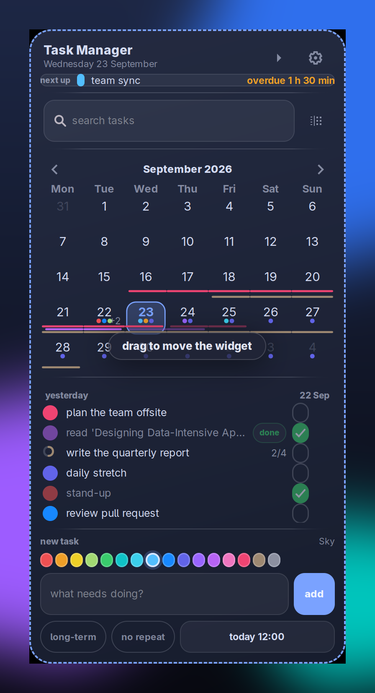
</p>

**The settings app**

| | |
|---|---|
| 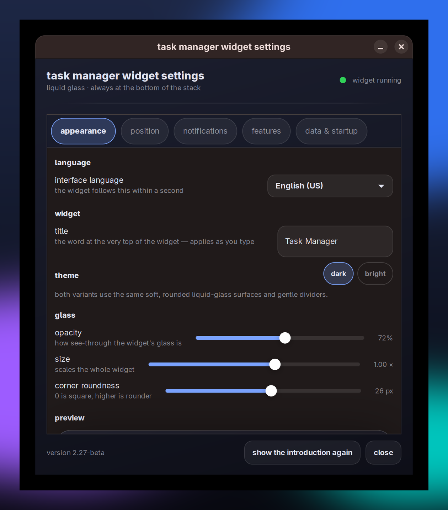 | 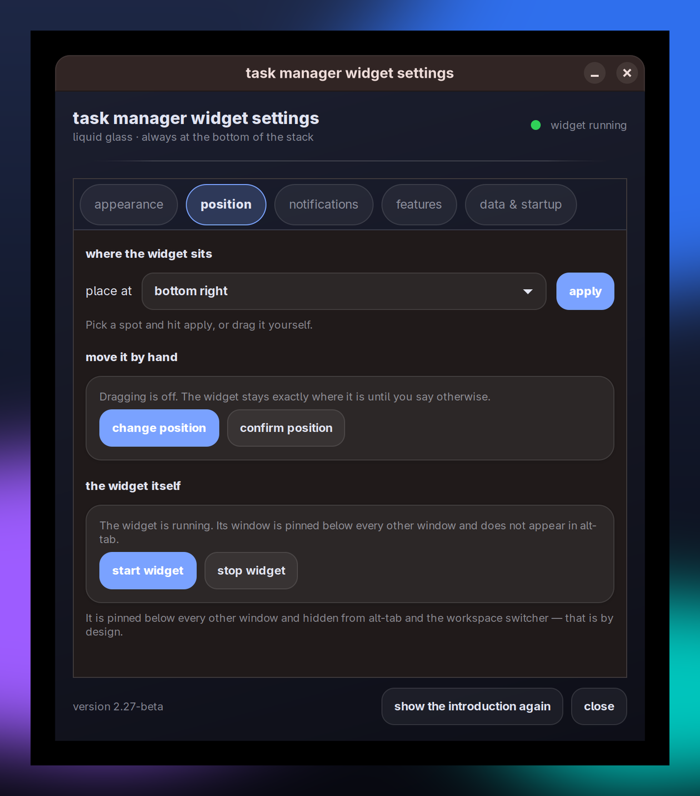 |
| 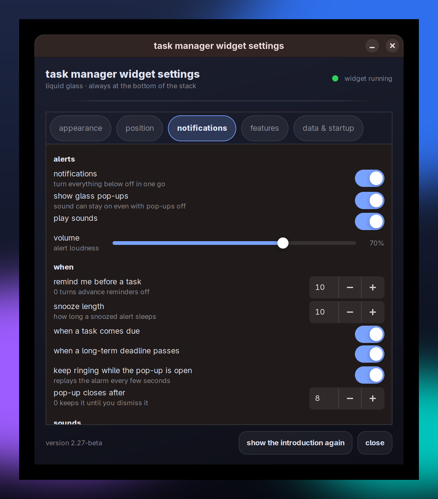 | 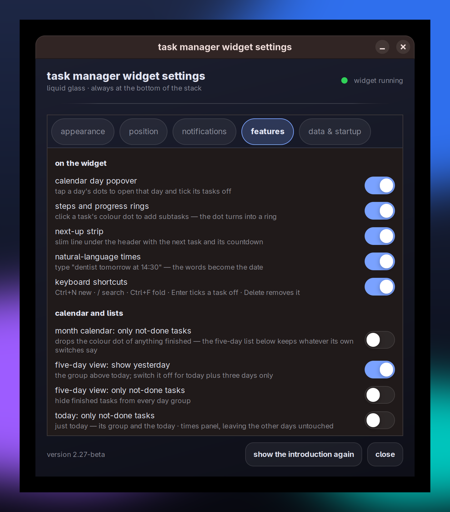 |
| 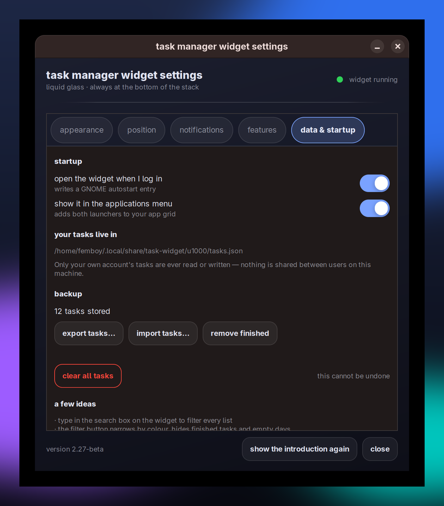 | 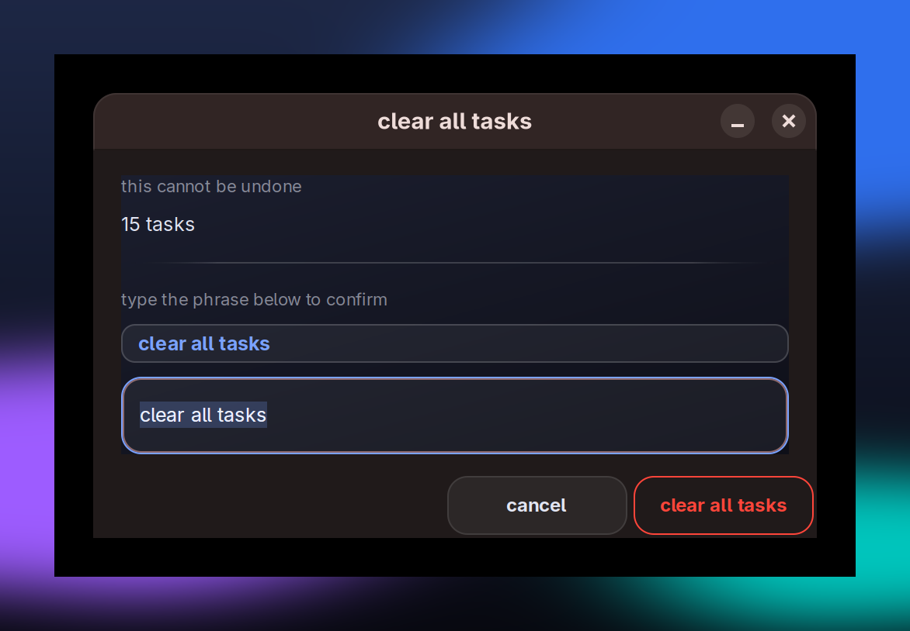 |

Regenerate any time with:

```sh
./tools/make-screenshots.sh
```

---

## Keyboard shortcuts

| key | action |
|---|---|
| `Ctrl+N` | focus the new-task field |
| `/` | focus search |
| `Ctrl+F` | fold / unfold |
| `Enter` / `Space` | tick off the focused task |
| `Delete` / `Backspace` | remove the focused task |
| `Esc` | leave the field |

Shortcuts work while the widget has focus (GNOME does not let applications
grab global hotkeys — add your own under *Settings → Keyboard → Custom
Shortcuts* if you want one).

---

## Data & privacy

| what | where |
|---|---|
| tasks (including steps) | `~/.local/share/task-widget/u<uid>/tasks.json` |
| alerts queued by do-not-disturb | `~/.local/share/task-widget/u<uid>/queue.json` |
| settings | `~/.config/task-widget/config.json` |
| position / folded state | `~/.config/task-widget/state.json` |

The `u<uid>` segment means each account only ever reads and writes **its
own** tasks — a file owned by another uid is never used as a fallback.

---

## Uninstall

```sh
./install.sh --uninstall
pip uninstall task-manager-widget     # only if you installed it with pip
```

Tasks and settings are left behind on purpose; delete the two folders above
for a completely clean slate.

---

## Development

```sh
python3 tests/run_tests.py     # 117 behavioural checks, no framework needed
./tools/make-screenshots.sh    # refresh docs/screenshots/
```

`TASKWIDGET_DEBUG_POPOVER=when|filter|day|steps|drag` opens that popover a
second after start-up. `TASKWIDGET_BACKEND=wayland` runs on Wayland instead
of XWayland (stacking and taskbar hints will not work there).

Changelog: [CHANGELOG.md](CHANGELOG.md).

---

## Licence

MIT — see [LICENSE](LICENSE).
